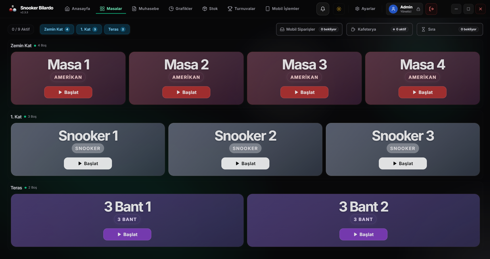
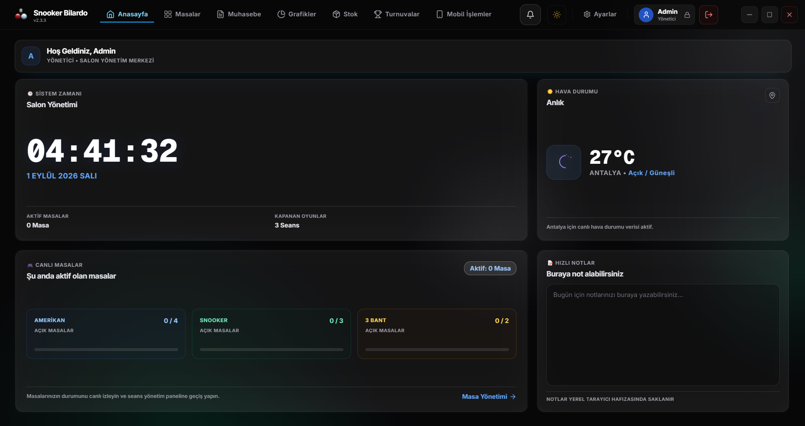
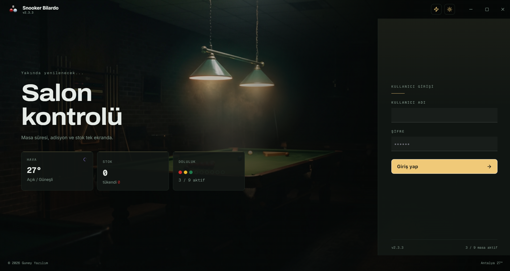

# Snooker Bilardo

### Salon Yönetim Sistemi

Masa seansları, adisyon, stok, cari hesap ve muhasebeyi tek uygulamada birleştiren masaüstü salon yönetim yazılımı.

**[Son Sürümü İndir](https://github.com/medrearalid/snooker-releases/releases/latest)**  ·  [Özellikler](#özellikler)  ·  [Kurulum](#kurulum)  ·  [Sık Sorulan Sorular](#sık-sorulan-sorular)

---

## Genel Bakış

Bilardo ve snooker salonlarının günlük işleyişi kâğıt fişler, hafızada tutulan masa saatleri ve gün sonunda tutmayan kasa üzerine kuruludur. Snooker Bilardo bu döngüyü kapatır:

- Masa süresi otomatik işler, hesap kuruş hassasiyetinde kapanır.
- Adisyona eklenen her ürün stoktan düşer; gün sonu ciro raporu kendiliğinden oluşur.
- Hangi personelin hangi masayı açtığı, kimin indirim uyguladığı ve hangi kaydın düzeltildiği denetim kaydına işlenir.
- Windows 7 dahil eski salon donanımlarında tek kurulumla çalışır.

---

## Ekran Görüntüleri

### Masa Yönetimi

Kat ve salon bazlı masa yerleşimi; masa tipine göre renk ayrımı, doluluk özeti ve mobil sipariş, kafeterya ve sıra göstergeleri.

### Yönetim Paneli

Aktif masa ve kapanan seans özeti, masa tipine göre doluluk dağılımı, canlı hava durumu ve günlük not alanı.

### Muhasebe

İşlem akışı, gider takibi, veresiye defteri ve düzeltme geçmişi; tarih aralığı, kategori ve serbest metin ile filtreleme.

### Personel Girişi

Kullanıcı adı ve şifre ile personel girişi; giriş ekranında salon doluluk, stok ve hava durumu özeti.

---

## Özellikler

### Masa ve Seans Yönetimi

- Süreli ve süresiz masa açma
- Masa duraklatma, devam ettirme ve masalar arası taşıma
- Kat / salon bazlı masa yerleşimi; masa tipine göre gruplama (Amerikan, Snooker, 3 Bant)
- Açılış ücreti ve dakika başı ücret modeli
- Saat aralığına göre tarife tanımı; gece yarısını aşan aralıklar desteklenir

### Adisyon ve Kafeterya

- Masaya yiyecek ve içecek ekleme, adisyonu anlık görüntüleme
- Satılan ürünün stoktan otomatik düşülmesi
- Ürün bazlı fiyat geçmişinin korunması; geçmiş adisyonlar sonradan değişmez
- Oyuncu bazlı hesap bölme ve kısmi ödeme
- Yetkiye bağlı ve üst limitli indirim / ikram uygulaması

### Muhasebe ve Kasa

- Tüm parasal hesaplar tam sayı kuruş üzerinden yapılır; yuvarlama farkı oluşmaz
- Nakit, kart ve veresiye ayrımıyla günlük kasa özeti
- Gider kalemleri ve operasyonel net akış takibi
- Düzeltme geçmişi: sonradan değiştirilen kayıtların izlenmesi

### Cari Hesap

- Müşteri bazlı borç kaydı ve tahsilat geçmişi
- Kısmi ödeme, borç kapatma ve bakiye takibi

### Raporlama ve Grafikler

- Günlük, haftalık ve aylık ciro grafikleri
- En çok oynanan masalar ve en çok satan ürünler
- Doluluk oranı ve yoğun saat analizi
- Serbest tarih aralığı ile geçmişe dönük inceleme

### Stok Yönetimi

- Ürün tanımı, kritik stok uyarısı ve sayım düzeltmesi
- Alış / satış fiyatı ve kâr marjı takibi

### Turnuva Yönetimi

- Turnuva oluşturma, katılımcı ve eşleşme takibi

### Personel ve Yetkilendirme

- Kullanıcı bazlı giriş
- Rol bazlı yetkilendirme: ekran erişimi, indirim yetkisi ve kayıt silme yetkisi ayrı ayrı tanımlanır
- Kritik işlemler için denetim kaydı

### Arayüz

- Açık ve koyu tema
- Düşük donanım için performans modu; ağır görsel efektler kapatılır
- Türkçe arayüz, dokunmatik ekrana uygun yerleşim

### Otomatik Güncelleme

- Yeni sürüm yayınlandığında uygulama kendini günceller; kurulum dosyasının tekrar indirilmesi gerekmez

---

## Mobil Erişim

Salon sahibi ve yetkili personel için Android istemcisi. Masaüstü uygulamadaki **Mobil İşlemler** modülü üzerinden yönetilir.

- QR kod ile cihaz eşleştirme: masaüstü uygulama QR kodu gösterir, telefon okutur, cihaz yetkilendirilir
- Yerel ağ bağlantısı: aynı Wi-Fi ağındaki kasa ile doğrudan iletişim
- Masa durumlarının ve anlık cironun telefondan görüntülenmesi
- Bağlantı kesintilerinde otomatik yeniden bağlanma

---

## Kurulum

1. [Releases](https://github.com/medrearalid/snooker-releases/releases/latest) sayfasından `Setup` ile başlayan `.exe` dosyasını indirin.
2. Kurulumu çalıştırın ve tamamlayın.
3. Uygulamayı açıp size verilen lisans anahtarı ile aktivasyonu yapın.
4. Ayarlar ekranından masaları, tarifeleri ve ürünleri tanımlayın.

**Windows 7 kullanıcıları:** Uygulama Windows 7 SP1 desteğini bilinçli olarak korumaktadır. Ayrı bir sürüm indirmenize gerek yoktur; güncel sürüm Windows 7 üzerinde çalışır.

**SmartScreen uyarısı:** Windows bilinmeyen yayıncı uyarısı gösterirse `Daha fazla bilgi` → `Yine de çalıştır` adımlarını izleyin.

### Sistem Gereksinimleri

| | Minimum | Önerilen |
|---|---|---|
| İşletim sistemi | Windows 7 SP1 (64-bit) | Windows 10 / 11 (64-bit) |
| İşlemci | Çift çekirdek | Dört çekirdek |
| Bellek | 4 GB RAM | 8 GB RAM |
| Disk alanı | 500 MB | 1 GB |
| Ekran çözünürlüğü | 1366 × 768 | 1920 × 1080 |
| İnternet | Aktivasyon ve güncelleme için gerekli | — |

---

## Veri Güvenliği

- Veriler salon bilgisayarında yerel SQLite veritabanında tutulur; günlük işleyiş internet bağlantısı olmadan da sürer.
- Finansal işlemler işlem bütünlüğü içinde yazılır; elektrik kesintisinde yarım kalan bir hesap veritabanını bozmaz.
- Uygulama her açılışta veritabanı bütünlüğünü denetler ve gerektiğinde onarım uygular.
- Personel şifreleri şifrelenmiş olarak saklanır; düz metin olarak hiçbir yerde tutulmaz.
- Geçmişe ve raporlara konu olan kayıtlar kalıcı olarak silinmez; yumuşak silme uygulanır.

---

## Teknoloji

| Katman | Kullanılan teknoloji |
|---|---|
| Masaüstü çatı | Electron 22 (Windows 7 desteği için sabitlenmiştir) |
| Arayüz | React 18, TypeScript, Vite, Zustand |
| Tasarım sistemi | Tailwind CSS, Radix UI, Lucide |
| Grafikler | Recharts, Visx |
| Veritabanı | SQLite, Prisma, better-sqlite3 |
| Bulut servisleri | Supabase (lisanslama, salon üyeliği, mobil erişim) |
| Mobil istemci | Flutter (Android) |
| Kalite kontrol | Vitest, ESLint, TypeScript strict |

---

## Sık Sorulan Sorular

<b>İnternet bağlantısı olmadan çalışır mı?</b>

Evet. Günlük salon işleyişi tamamen yereldir. İnternet yalnızca ilk aktivasyon, lisans doğrulama ve otomatik güncelleme için gereklidir.

<b>Veriler nerede saklanıyor?</b>

Salon bilgisayarınızdaki yerel veritabanında. Adisyon, ciro ve müşteri bilgileri sizde kalır.

<b>Birden fazla bilgisayarda kullanabilir miyim?</b>

Lisans salon bazlıdır. Ek cihaz ihtiyacınız için iletişime geçin.

<b>Güncellemeler ücretli mi?</b>

Hayır. Lisansınız aktif olduğu sürece güncellemeler otomatik olarak gelir.

<b>Eski bir bilgisayarda performans sorunu yaşar mıyım?</b>

Ayarlar → Sistem bölümündeki performans modu ağır görsel efektleri devre dışı bırakır ve düşük donanımda akıcı çalışmayı sağlar.

<b>Mevcut verilerimi aktarabilir miyim?</b>

Veri aktarımı talepleriniz için iletişime geçin.

---

## Destek ve Hata Bildirimi

Hata bildirimi ve özellik talepleriniz için [Issues](https://github.com/medrearalid/snooker-releases/issues) sayfasını kullanabilirsiniz. Bildiriminize aşağıdaki bilgileri eklemeniz çözüm süresini kısaltır:

- Uygulama sürümü (Ayarlar → Sistem ekranında görüntülenir)
- İşletim sistemi ve sürümü
- Hatanın oluştuğu adımlar
- Varsa ekran görüntüsü

---

## Geliştirici

**Güney Yazılım**

Bu depo yalnızca yayınlanmış sürümleri ve ürün dokümantasyonunu barındırır. Kaynak kod özel bir depoda tutulmaktadır.

© 2026 Güney Yazılım — Tüm hakları saklıdır.

