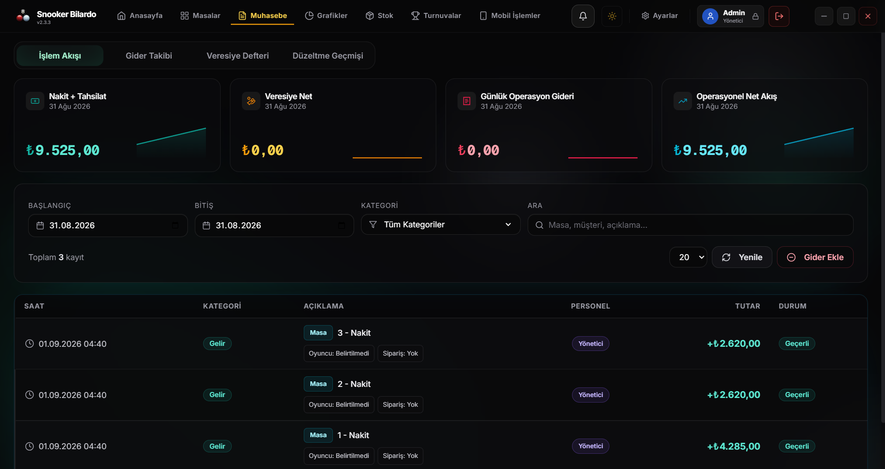

# 🎱 Snooker & Bilardo Salon Yönetim Sistemi

**Masa takibi, adisyon, stok, cari hesap ve raporlamayı tek ekranda toplayan masaüstü salon yazılımı.**

[**⬇️ Son Sürümü İndir**](https://github.com/medrearalid/snooker-releases/releases/latest) &nbsp;·&nbsp; [Özellikler](#-özellikler) &nbsp;·&nbsp; [Kurulum](#-kurulum) &nbsp;·&nbsp; [Mobil Uygulama](#-mobil-uygulama)

---

## Neden bu yazılım?

Bilardo salonlarının günlük işleyişi kâğıt fişler, hafızada tutulan saatler ve gün sonunda tutmayan kasa üzerine kuruludur. Bu yazılım o döngüyü kapatır:

- Masa saati **otomatik** işler, hesap **kuruş hassasiyetinde** kapanır.
- Adisyona eklenen her ürün **stoktan düşer**, gün sonu ciro raporu **kendiliğinden** oluşur.
- Kim hangi masayı açtı, kim indirim yaptı, hangi hesap silindi — hepsi **kayıt altındadır**.
- Eski salon bilgisayarlarında, **Windows 7** dahil, tek kurulumla çalışır.

---

## 📸 Ekran Görüntüleri

Masa yönetimi — kat/salon bazlı masa ızgarası, canlı süre ve tutar takibi.

<!--
  Ek ekran görüntüsü alanları. Görselleri `docs/screenshots/` altına
  aşağıdaki isimlerle koyup bu bloğun yorumunu kaldırmak yeterlidir.

| Adisyon & Kafeterya | Muhasebe & Raporlar |
|:---:|:---:|
|  |  |

| Grafikler | Stok Yönetimi |
|:---:|:---:|
|  |  |

| Cari / Veresiye | Ayarlar & Tarifeler |
|:---:|:---:|
|  |  |
-->

---

## ✨ Özellikler

### ⏱ Masa ve Seans Yönetimi
- Süreli (ör. 1 saatlik) ve süresiz masa açma
- Masa duraklatma, devam ettirme ve **masalar arası taşıma**
- Kat / salon bazlı masa yerleşimi ve isimlendirme
- Açılış ücreti + dakika başı ücret modeli
- **Saat aralığına göre tarife**: gündüz/gece farklı saatlik ücret, gece yarısını aşan aralıklar dahil

### ☕ Adisyon ve Kafeterya
- Masaya yiyecek/içecek ekleme, adisyonu anlık görme
- Satılan ürün **stoktan otomatik düşer**
- Ürün bazlı fiyat geçmişi korunur — eski adisyonlar sonradan değişmez
- **Oyuncu bazlı hesap bölme** ve kısmi ödeme
- İkram ve indirim — yetkiye bağlı, üst limitli

### 💰 Hesap ve Muhasebe
- Tüm para hesapları **tam sayı kuruş** üzerinden yapılır; yuvarlama hatası oluşmaz
- Nakit / kart / veresiye ödeme ayrımı
- Gün sonu kasa kapanışı, gelir–gider kalemleri
- Personel harcamaları ve sabit gider takibi

### 🧾 Cari Hesap (Veresiye)
- Müşteri bazlı borç kaydı ve tahsilat geçmişi
- Kısmi ödeme, borç kapatma, bakiye takibi

### 📊 Raporlama ve Grafikler
- Günlük / haftalık / aylık ciro grafikleri
- En çok oynanan masalar, en çok satan ürünler
- Doluluk oranı ve yoğun saat analizi
- Tarih aralığı seçerek geçmişe dönük inceleme

### 📦 Stok Yönetimi
- Ürün girişi, kritik stok uyarısı, sayım düzeltmesi
- Alış/satış fiyatı ve kâr marjı takibi

### 🏆 Turnuva Modülü
- Turnuva oluşturma, katılımcı ve eşleşme takibi

### 👥 Personel ve Yetkilendirme
- Kullanıcı bazlı PIN girişi
- **Rol bazlı yetki**: hangi personel hangi ekranı görür, kim indirim yapabilir, kim hesap silebilir
- Kritik işlemler için **denetim kaydı** (audit log) — kim, ne zaman, ne yaptı

### 🌗 Arayüz
- Açık ve koyu tema
- Eski donanım için **performans modu**: ağır animasyon ve efektler kapanır
- Türkçe arayüz, dokunmatik ekrana uygun büyük hedefler

### 🔄 Otomatik Güncelleme
- Yeni sürüm çıktığında uygulama kendini günceller; kurulum dosyasını tekrar indirmeye gerek yoktur

---

## 📱 Mobil Uygulama

Salon sahibi ve yetkili personel için Android istemcisi.

- **QR ile eşleştirme:** Masaüstü uygulama bir QR kod gösterir, telefon okutur, cihaz eşleşir
- **Yerel ağ üzerinden bağlantı:** Aynı Wi-Fi ağındaki kasa ile doğrudan konuşur
- Masa durumlarını ve anlık ciroyu telefondan görüntüleme
- Bağlantı koptuğunda otomatik yeniden bağlanma

---

## 📥 Kurulum

1. [**Releases**](https://github.com/medrearalid/snooker-releases/releases/latest) sayfasından `Setup` ile başlayan `.exe` dosyasını indirin.
2. Dosyayı çift tıklayıp kurulumu tamamlayın.
3. Uygulamayı açın ve size verilen **lisans anahtarı** ile aktivasyonu yapın.
4. Ayarlar ekranından masalarınızı, tarifelerinizi ve ürünlerinizi tanımlayın.

> **Windows 7 kullanıyorsanız:** Uygulama Windows 7 SP1 desteğini bilinçli olarak korumaktadır. Ek bir sürüm indirmenize gerek yoktur, güncel sürüm Windows 7'de çalışır.

> **SmartScreen uyarısı:** Windows bilinmeyen yayıncı uyarısı verirse `Daha fazla bilgi` → `Yine de çalıştır` adımlarını izleyin.

### 💻 Sistem Gereksinimleri

| | Minimum | Önerilen |
|---|---|---|
| İşletim sistemi | Windows 7 SP1 (64-bit) | Windows 10 / 11 (64-bit) |
| İşlemci | Çift çekirdek | Dört çekirdek |
| RAM | 4 GB | 8 GB |
| Disk | 500 MB boş alan | 1 GB boş alan |
| Ekran | 1366 × 768 | 1920 × 1080 |
| İnternet | Aktivasyon ve güncelleme için gerekli | — |

---

## 🔐 Veri Güvenliği

- Veriler salon bilgisayarında **yerel SQLite veritabanında** tutulur; günlük işleyiş internet olmadan da sürer.
- Elektrik kesintisine karşı işlem bütünlüğü korunur — yarım kalan hesap veritabanını bozmaz.
- Uygulama her açılışta veritabanı bütünlüğünü kontrol eder ve gerekiyorsa kendini onarır.
- Personel PIN'leri **şifrelenmiş** saklanır, düz metin olarak hiçbir yerde tutulmaz.
- Kritik işlemler geri alınamaz şekilde silinmez; geçmiş ve raporlar için **yumuşak silme** kullanılır.

---

## 🛠 Kullanılan Teknolojiler

| Katman | Teknoloji |
|---|---|
| Masaüstü kabuk | Electron 22 *(Windows 7 desteği için sabit)* |
| Arayüz | React 18, TypeScript, Vite, Zustand |
| Tasarım | Tailwind CSS, Radix UI, Lucide |
| Grafikler | Recharts, Visx |
| Veritabanı | SQLite + Prisma (`better-sqlite3`) |
| Bulut | Supabase — lisanslama, salon üyeliği, mobil erişim |
| Mobil | Flutter (Android) |
| Kalite | Vitest, ESLint, TypeScript strict |

---

## ❓ Sık Sorulan Sorular

<b>İnternet olmadan çalışır mı?</b>

Evet. Günlük salon işleyişi tamamen yereldir. İnternet yalnızca ilk aktivasyon, lisans doğrulama ve otomatik güncelleme için gerekir.

<b>Verilerim nerede tutuluyor?</b>

Salon bilgisayarınızdaki yerel veritabanında. Adisyon, ciro ve müşteri bilgileriniz sizde kalır.

<b>Birden fazla bilgisayarda kullanabilir miyim?</b>

Lisans salon bazlıdır. Ek cihaz ihtiyacınız için iletişime geçin.

<b>Güncellemeler ücretli mi?</b>

Hayır. Lisansınız aktif olduğu sürece güncellemeler otomatik gelir.

<b>Eski bilgisayarımda yavaş çalışır mı?</b>

Ayarlar → Sistem bölümündeki **performans modu** ağır görsel efektleri kapatır ve düşük donanımda akıcı çalışmayı sağlar.

---

## 🐛 Hata Bildirimi ve Talepler

Bir hata ile karşılaştıysanız ya da yeni bir özellik öneriniz varsa [**Issues**](https://github.com/medrearalid/snooker-releases/issues) üzerinden bildirebilirsiniz. Hata bildiriminde şunları eklemeniz çözümü hızlandırır:

- Uygulama sürümü (Ayarlar → Sistem ekranında yazar)
- İşletim sistemi
- Hatanın oluştuğu adımlar ve varsa ekran görüntüsü

---

## 👨‍💻 Geliştirici

**Güney Yazılım**

Bu depo yalnızca yayınlanmış sürümleri ve dokümantasyonu barındırır. Kaynak kod özel bir depoda tutulmaktadır.

© Güney Yazılım — Tüm hakları saklıdır.

